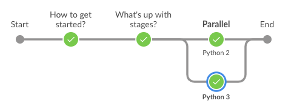

# Jenkins 101

A short introduction to jenkins.

## 001 How to start?

1. Create a file named `Jenkinsfile`
1. add the simplest *pipeline* we can think of

## 002 What's up with `stage`s?

* Stages can have different options or separate agents

    In plain speak that means that you can run on different servers or
    in different docker containers.

    A good example would be where you need to execute actions that require
    Python2 for one part and Python3 for another part.

* Stages are a serialization or parallelization mechanism

    In plain speak that means that you can run either one after the other
    or have several stages run side by side.

    

* Go! Take a look!

/M
